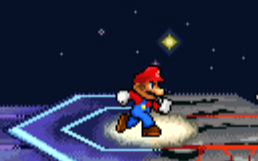
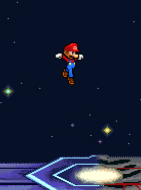
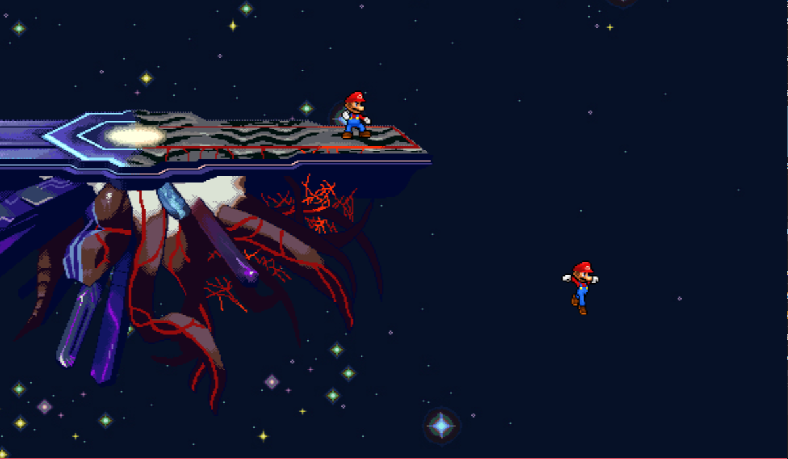
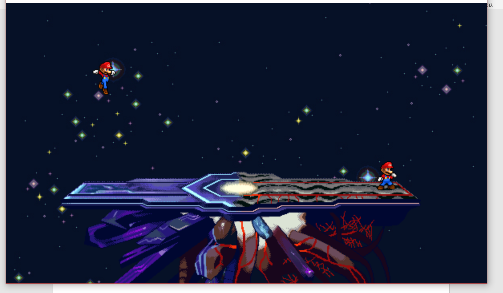
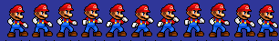
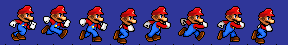
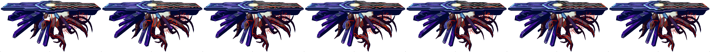
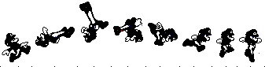
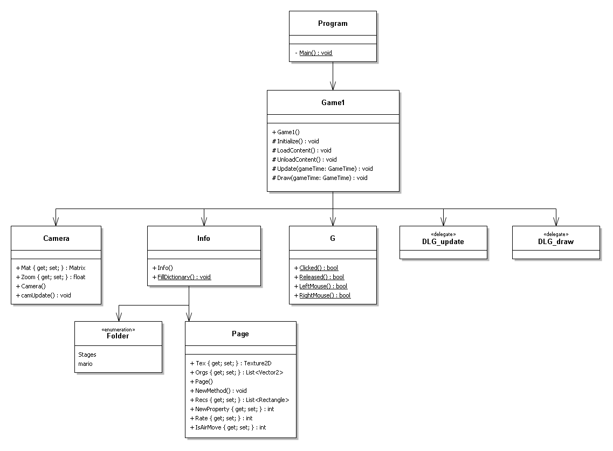
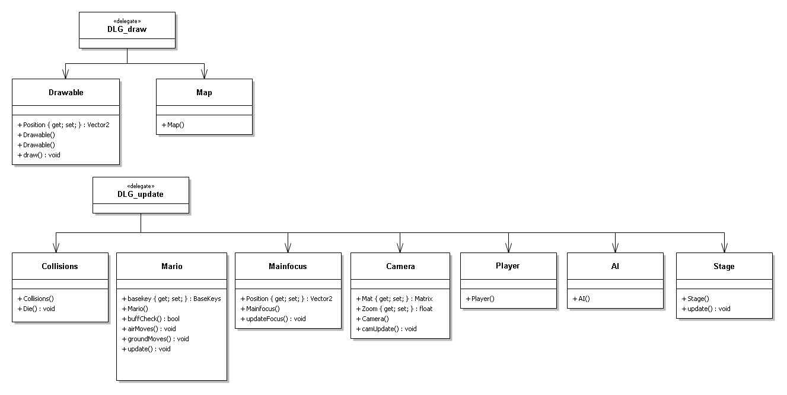

# Mario Smash

> ⚠️ **Unofficial fan-made project.** Mario Smash is a non-commercial fan game inspired by Nintendo's **Super Smash Bros.** series. It is **not** affiliated with, endorsed by, sponsored by, or approved by Nintendo. *Mario*, *Super Smash Bros.*, and all related characters, names, and artwork are trademarks and copyrights of **Nintendo** (and HAL Laboratory / Sora Ltd. where applicable). All Nintendo-owned assets in this repository belong to their respective owners and are used for educational, non-commercial purposes only. No copyright infringement is intended. See [Legal notice](#legal-notice).

A 2D platform fighter written in **C#** with **MonoGame**, built from scratch as a high-school final project (June 2019). Two Marios face off on a floating platform in space, the last one standing wins.


---

## Table of contents

- [Features](#features)
- [Screenshots](#screenshots)
- [Controls](#controls)
- [Building and running](#building-and-running)
- [How it works](#how-it-works)
  - [Animation system](#animation-system)
  - [Input abstraction](#input-abstraction)
  - [State buffering](#state-buffering)
  - [Camera](#camera)
  - [Collision detection with masks](#collision-detection-with-masks)
- [Architecture (UML)](#architecture-uml)
- [Project structure](#project-structure)
- [Roadmap and ideas for improvement](#roadmap-and-ideas-for-improvement)
- [Legal notice](#legal-notice)

---

## Features

- Local two-player versus on one keyboard
- Sprite-sheet animations (standing, running, jumping, falling) and an animated stage
- Gravity, jumping, and landing on a floating platform
- Dynamic camera that follows the midpoint between the fighters
- Circle-based hitbox / hurtbox collision driven by color-coded "mask" images
- Respawn when a fighter leaves the map boundaries
- Input layer that works for both human players and a (planned) AI opponent

## Screenshots

| Running on the stage | Jumping |
| :---: | :---: |
|  |  |

**The camera follows the fighters around the arena:**



**Fighters can jump off and land back on the stage:**



## Controls

| Action | Player 1 | Player 2 |
| --- | --- | --- |
| Move left / right | `A` / `D` | `←` / `→` |
| Jump | `W` | `↑` |
| Down | `S` | `↓` |
| Attack | `Tab` | `Right Shift` |
| Shield | `Q` | `Numpad 0` |
| Quit | `Esc` | `Esc` |

> Attack and shield inputs are wired into the input layer, but the attack animations are not yet registered in the game loop (see the [roadmap](#roadmap-and-ideas-for-improvement)).

## Building and running

**Requirements**

- Windows
- Visual Studio (2017 or newer) with the .NET desktop workload
- .NET Framework 4.5
- [MonoGame 3.x](https://www.monogame.net/) for Windows (the project uses the MonoGame 3.0 MSBuild targets and the Content Pipeline)

**Steps**

1. Install MonoGame 3.x so the `MonoGame.Content.Builder` targets are available.
2. Clone the repository:
   ```bash
   git clone https://github.com/LiavSamiya/mario-smash.git
   ```
3. Open `Smash.csproj` in Visual Studio.
4. Build and run (x86, Debug). The Content Pipeline compiles everything in `Content/` into `.xnb` files automatically.

## How it works

### Animation system

All animations are **sprite sheets**. Each sheet is a horizontal strip of frames; the **last row of pixels** contains black marker pixels that tell the engine where each frame starts and where its origin (the "handle" point used for positioning) is. At load time, the `Page` class:

1. Reads the marker row and slices the sheet into frame rectangles.
2. Computes each frame's origin from the markers.
3. Makes the background color transparent.

| Standing | Running |
| :---: | :---: |
|  |  |

The stage itself is animated the same way:



Every animation is stored in a two-level dictionary in `Info`: **`Folder` (character/object) → file name (animation) → `Page`**. Each animation also has metadata (frame rate, whether it is a ground or air move, and its collision type).

I chose sprite sheets over a skeletal (joint-based) animation system: fighters have a fixed move set and a bounded range of motion, so pre-drawn frames look good and were far quicker to produce.

### Input abstraction

Controls are built on an abstract class, `BaseKeys`, with `Left()`, `Right()`, `Up()`, `Down()`, `Attack()` and `Shield()`. Two implementations exist:

- **`UserKeys`**: reads the keyboard.
- **`BotKeys`**: returns booleans set by code, for a computer-controlled fighter.

Because the fighter only talks to `BaseKeys`, the same character logic serves both a human and an AI. I preferred this over making the AI inherit from the player, since it keeps the door open for player-only abilities later.

### State buffering

A fighter doesn't switch animations instantly. The next state and facing direction are stored in a **buffer** and applied only when the current animation finishes. Standing and running ignore the buffer so they can be interrupted at any frame. Without buffering, players would need to press a button on the exact final frame of an animation to chain moves, and the game would feel stiff.

### Camera

The camera is built with **transformation matrices**. It receives any object implementing the `Ifocus` interface and eases toward that focus point every frame. The focus also reports a zoom level based on how far the action is from the center of the map. By default the camera follows `Mainfocus` (the midpoint of all players), but because it only depends on the interface, it could just as easily follow a single player or stay fixed. This lets the arena be larger than the window without shrinking everything.

### Collision detection with masks

Each animation has a matching **mask** image: a black-and-white copy of the sprite with colored marker pixels.

| Original (up-air) | Mask |
| :---: | :---: |
|  |  |

- Each circle is defined by **two points** of the same color: the first is the center, the second is a point on the circumference.
- **Blue** circles are **hurtboxes** (where the fighter can be hit); **red** circles are **hitboxes** (where an attack deals damage).
- Two circles collide when the distance between their centers is less than or equal to the sum of their radii.

Outcomes:

- **Hurtbox vs. hurtbox**: the fighters block each other.
- **Hitbox vs. hurtbox**: the defender receives a knockback vector, added to their position.
- **Hitbox vs. hitbox**: both fighters receive knockback.

Circles fit the characters much more tightly than rectangles, which avoids false hits on rectangle corners. Collision with the stage is currently based on the stage's dimensions.

## Architecture (UML)

**Inheritance: drawing and camera focus**


**Inheritance: input**


**Composition: game structure**



**Classes subscribed to the update / draw delegates**



The game loop is event-driven: `Game1` exposes two events, `event_update` (`DLG_update`) and `event_draw` (`DLG_draw`). Every object that needs to update or draw subscribes itself in its constructor, so `Game1` never needs to know about individual objects.

The project also demonstrates core OOP concepts: inheritance, polymorphism (`virtual` / `override`), interfaces (`Ifocus`), abstract classes (`BaseKeys`), delegates and events, and encapsulation (`public` / `protected` / `private`).

## Project structure

| File | Responsibility |
| --- | --- |
| `Program.cs` | Entry point |
| `Game1.cs` | MonoGame game class: loading, update/draw events |
| `G.cs` | Global state, input helpers, `BaseKeys`, delegates |
| `Info.cs` | Animation dictionary and per-animation metadata |
| `Page.cs` | Sprite-sheet slicing, origins, transparency, mask parsing |
| `Drawable.cs` | Base class for anything drawn on screen |
| `Animations.cs` | Frame timing and animation playback |
| `Mario.cs` | Fighter movement, physics, and state machine |
| `Collisions.cs` | Hitbox / hurtbox collision between fighters |
| `Player.cs` | Human-controlled fighter and `UserKeys` |
| `AI.cs` | Computer-controlled fighter and `BotKeys` (skeleton) |
| `Camera.cs` | Matrix camera, `Ifocus`, `Mainfocus` |
| `Engine.cs` | Out-of-bounds detection and respawn |
| `Map.cs`, `Stage.cs` | Background and animated stage |
| `Content/` | Sprite sheets, masks, and the MonoGame content project |

## Roadmap and ideas for improvement

**Gameplay**

- [ ] Register the existing attack animations (jab, multi-jab, up-tilt, up/down smash, neutral-air, up-air) in `Info.Files` and hook them to the attack key
- [ ] Damage percentage system where knockback scales with damage, as in the Smash series
- [ ] Stock system (lives) with a win screen: "last one standing wins"
- [ ] Working shield, dodge, and a double jump
- [ ] Finish the AI opponent (`BotKeys`): approach, attack in range, recover to the stage
- [ ] Hitstun and invincibility frames after being hit and after respawning
- [ ] Title screen, instructions page, and character/stage select

**Engine and code quality**

- [ ] Use frame-rate-independent physics (scale by `gameTime.ElapsedGameTime`)
- [ ] Replace the dimension-based stage collision with mask-based collision so fighters can't clip through the stage edge
- [ ] Fix inheritance: `Player` and `AI` currently inherit from `Collisions`, which inherits from `Mario`. Composition (a `Fighter` that *has* a collider, an input source, and a character definition) would be cleaner and would make adding characters easy
- [ ] Unsubscribe *all* events (`update`, `updateCircles`, `Collide`, draw) when a fighter respawns, to avoid leaked objects that keep updating
- [ ] `updateCircles` multiplies radius and center by scale every frame, so hitboxes grow over time; compute world-space circles from the original values instead
- [ ] Move animation metadata (frame rate, air/ground, knockback) from hard-coded lists into JSON data files
- [ ] Replace string animation names (`"run"`, `"jump"`) with an enum
- [ ] Gamepad support via MonoGame's `GamePad` API
- [ ] Add sound effects and music
- [ ] Port to MonoGame 3.8 / .NET 8 (SDK-style project, cross-platform DesktopGL build)
- [ ] Add a GitHub Actions build

**Legal / distribution**

- [ ] Replace Nintendo-owned sprites and artwork with original or openly licensed art (for example, from [OpenGameArt](https://opengameart.org/)) and rename the game, so the engine can be shared and extended with no IP concerns

## Legal notice

This is a **fan-made, non-commercial, educational project**. It is not sold, monetized, or distributed as a commercial product, and it is **not affiliated with or endorsed by Nintendo**.

- *Mario*, *Super Smash Bros.*, and all related characters, names, logos, and artwork are © and ™ **Nintendo**. Sprites and stage artwork in `Content/` are derived from Nintendo properties and remain the property of their respective owners.
- The **source code** (the C# engine) is original work by Liav Samiya.
- If you are a rights holder and would like any asset removed, please [open an issue](https://github.com/LiavSamiya/mario-smash/issues) and it will be taken down promptly.

## Author

**Liav Samiya**: high-school final project, Kfar Hayarok school, 2019.
