# Mario Smash

[](https://github.com/LiavSamiya/mario-smash/actions/workflows/build.yml)

> ⚠️ **Unofficial fan-made project.** Mario Smash is a non-commercial fan game inspired by Nintendo's **Super Smash Bros.** series. It is **not** affiliated with, endorsed by, sponsored by, or approved by Nintendo or by any other rights holder. *Mario*, *Bowser* and *Super Smash Bros.* are trademarks and copyrights of **Nintendo**. *Kratos* / *God of War* belong to **Sony Interactive Entertainment**. *Sasuke Uchiha* / *Naruto* belong to **Masashi Kishimoto / Shueisha**. All character art belongs to its owners and to the sprite artists listed in [Credits](#credits). It is used for educational, non-commercial purposes only, and no copyright infringement is intended. See [Legal notice](#legal-notice).

A 2D platform fighter for 1 to 4 players, written in **C#** with **MonoGame**: an object-oriented, data-driven engine with CPU opponents, xUnit tests and a CI build on Windows and Linux. Choose from four fighters and knock your opponents off the floating platform. The more damage they have taken, the further they fly, and the last one standing wins.

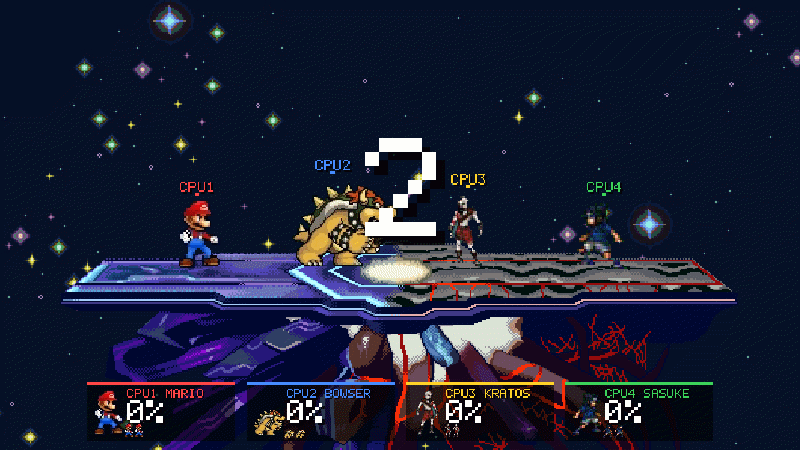

*Gameplay recorded by the game itself in full-screen resolution (1920 × 1080), shown at reduced size. Four level-3 CPUs: Mario, Bowser, Kratos and Sasuke.*

---

## Table of contents

- [Features](#features)
- [The fighters](#the-fighters)
- [Screenshots (full screen)](#screenshots-full-screen)
- [Controls](#controls)
- [Building and running](#building-and-running)
- [How the game works](#how-the-game-works)
- [Code structure: classes, structs and OOP](#code-structure-classes-structs-and-oop)
- [Key parts of the code](#key-parts-of-the-code)
- [Tools](#tools)
- [Tests](#tests)
- [Credits](#credits)
- [Legal notice](#legal-notice)

---

## Features

**Gameplay**
- 4 playable fighters, all with the same move set: jab, jab combo, running uppercut, up smash, down smash (hits both sides), neutral air and up air
- 1 to 4 players in any mix of humans (keyboard or gamepad) and CPUs
- Smash-style **damage percent**: a **percent multiplier** makes every hit launch further as damage builds up, and a **weight multiplier** (weight set by the fighter's size) makes big fighters harder to launch
- **Stock** matches with 1 to 9 lives, a countdown, "GAME!", and a results screen with KOs, falls, and damage dealt and taken
- Double jump, short hop, fast fall, **shield** (a hexagon energy bubble that shrinks, turns red and can break), rolls, spot dodge and directional **air dodge**
- **Ledge grab**: a fighter falling right past the tip of the platform grabs it and hangs for about a second. Press Up to climb, or Down to let go; otherwise the fighter falls. The grab zone is small and sits only at the visible ends of the stage.
- Hitlag (freeze frames), hitstun, clashing attacks, camera shake, hit sparks and invincibility after respawning
- **CPU opponents** at 3 difficulty levels that attack, shield, recover and climb back from the ledge

**Presentation**
- A **Tekken-inspired character select screen** with a 30-second timer, big animated previews, player cursors and 6 color **skins** for every fighter
- Title, how-to-play, settings, setup, pause and results screens
- **Resolution independent**: menus, HUD, damage numbers and camera are laid out for a 1200 × 700 screen and scaled to any window or full-screen size and aspect ratio (16:9, 16:10, 4:3), so full screen (F11) looks exactly like the window, only bigger
- A camera that follows all fighters and zooms out as they move apart, plus off-screen indicators
- All sound effects and **three original music tracks** are **synthesized in code**, so there are no audio files: an inspirational opening theme, a hype 8-bit battle theme, and a Tekken-inspired select theme
- **Settings** for music and sound effect volume, saved between sessions
- A hitbox viewer (F3) that shows hurtboxes, hitboxes and the stage collision box

## The fighters

| Fighter | Size | Weight | Knockback taken | Run speed | Style |
| --- | :---: | :---: | :---: | :---: | --- |
| **Sasuke** | medium | 94 | 106% | **7.4 (fastest)** | Fast sword combos and the highest jump |
| **Mario** | small | 90 | 111% | 5.8 (fast) | All-rounder with a quick jab combo and a breakdance down smash |
| **Kratos** | tall | 110 | 91% | 5.0 | Long reach with the axe and the chained blades |
| **Bowser** | huge | 140 (heaviest) | 71% | 4.2 | Hard to launch, hits hardest, spinning shell attacks |

Knockback taken = the weight multiplier (100 / weight). For example, a down smash from the middle of the stage knocks out Mario at about 100%, Sasuke at 105%, Kratos at 125% and Bowser at 155%.

Every fighter is defined by two JSON files in `src/Smash/Content/Characters/<Name>/`:
- `character.json` holds the physics and the moves.
- `frames.json` holds the animation frames cut from the character's sprite sheet in `src/Smash/Content/Spritesheets/`.

## Screenshots (full screen)

All pictures were rendered by the game at **1920 × 1080 full-screen resolution** (`Smash --screenshots`).

**Title screen**
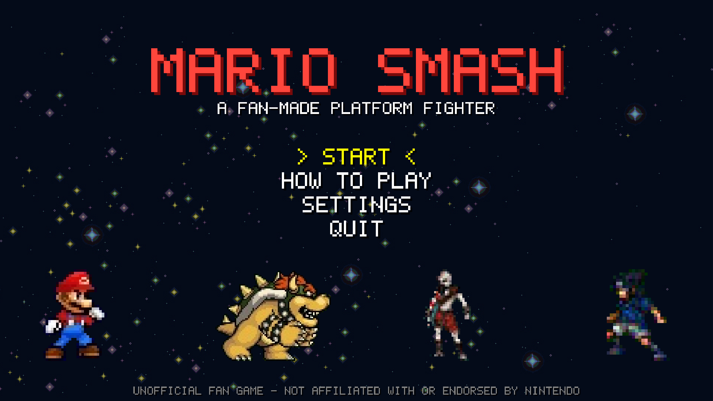

**Tekken-inspired character select**
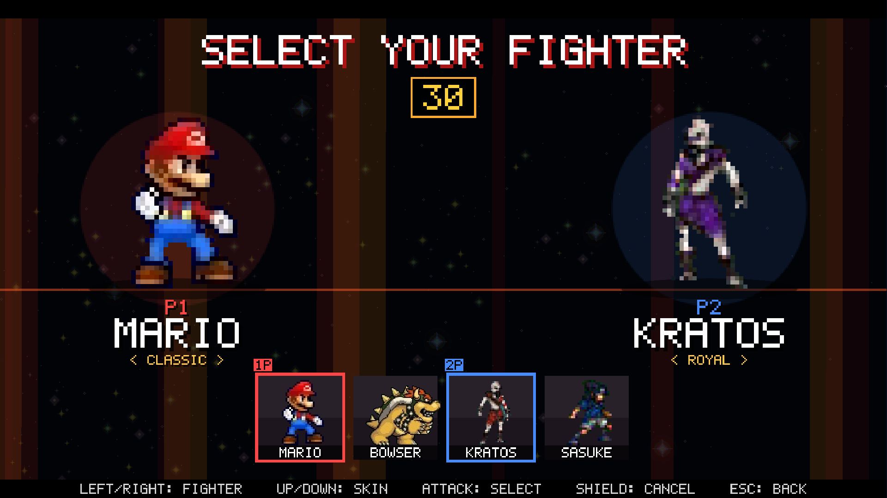

**Who is playing (humans, CPUs, controls, stocks)**
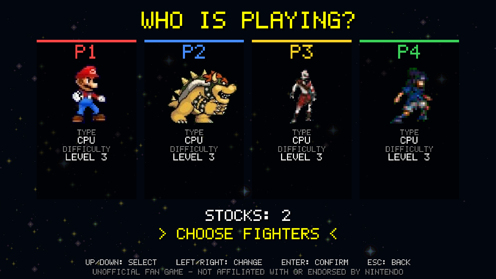

**Countdown**
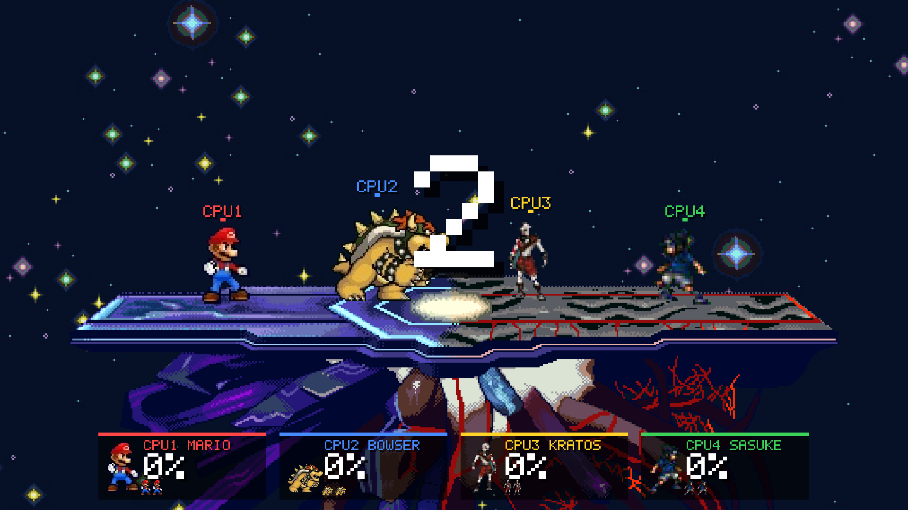

**Mid-match**
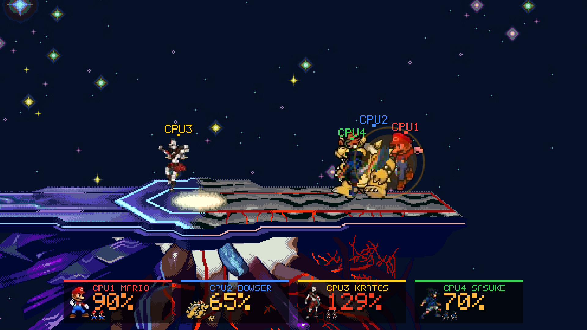

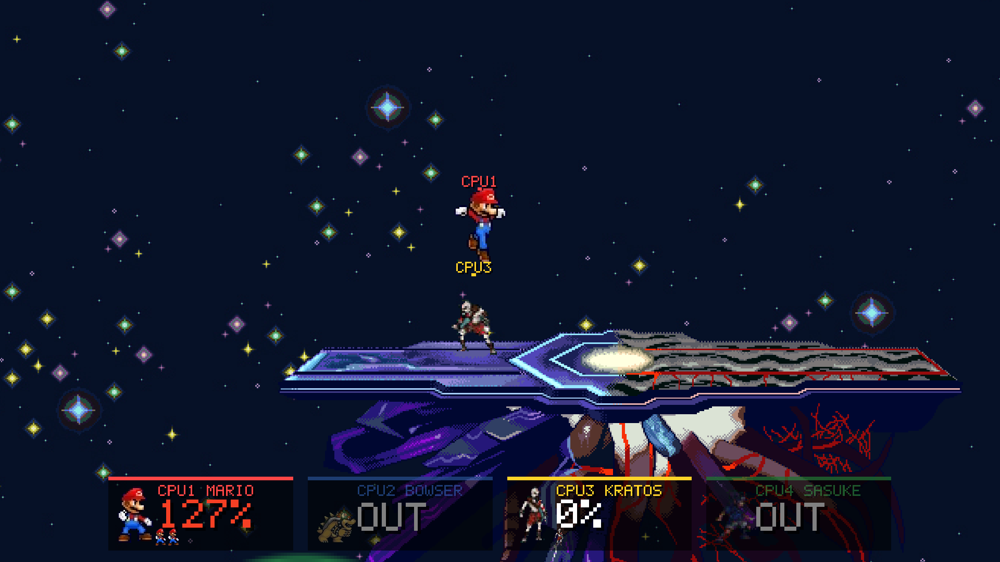

**Hitbox viewer (F3)**: blue = hurtboxes, red = hitboxes, yellow = body box, green = the stage's solid platform
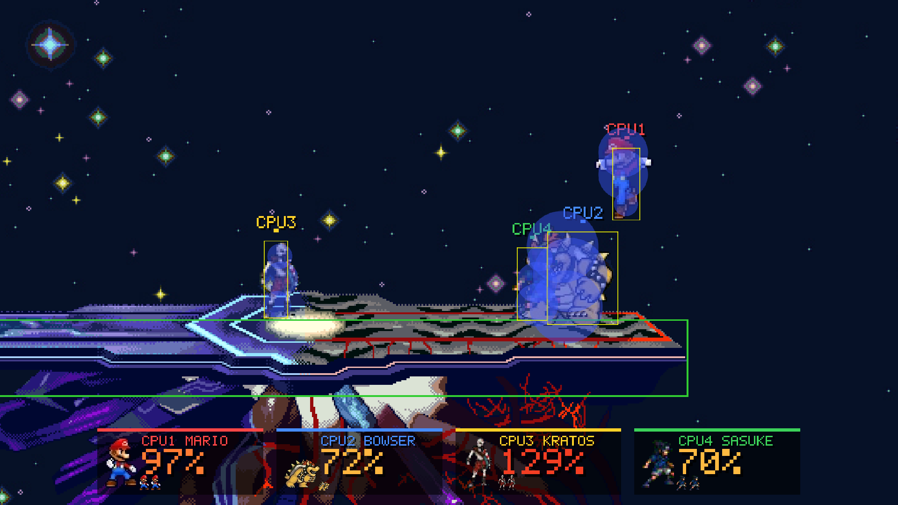

**Results**
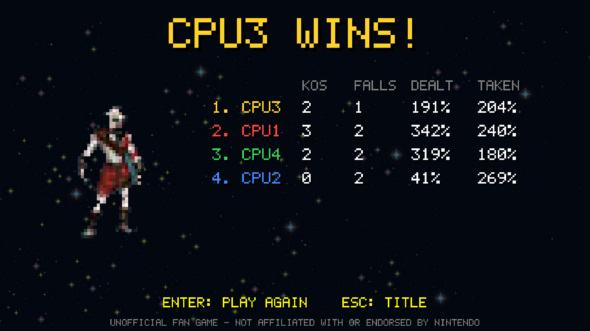

**Settings**
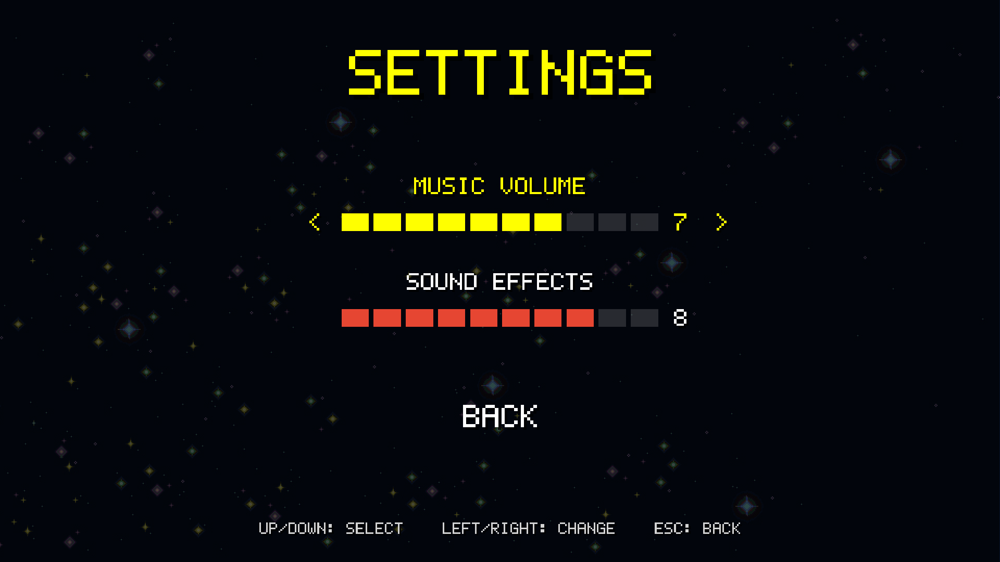

**How to play**
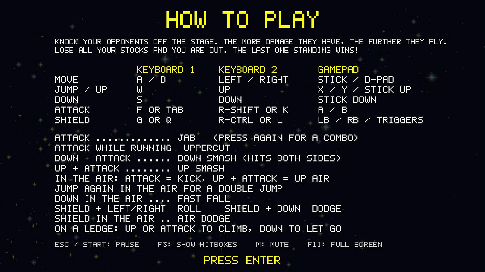

## Controls

**In a match**

| Action | Keyboard 1 | Keyboard 2 | Gamepad |
| --- | --- | --- | --- |
| Move | `A` / `D` | `←` / `→` | Left stick / D-pad |
| Jump / aim up | `W` | `↑` | `X` / `Y` / stick up |
| Down | `S` | `↓` | Stick down |
| Attack | `F` or `Tab` | `Right Shift` or `K` | `A` / `B` |
| Shield | `G` or `Q` | `Right Ctrl`, `L` or `Numpad 0` | Bumpers / triggers |
| Pause | `Esc` or `P` | | `Start` |

| Move | Input |
| --- | --- |
| Jab, then jab combo | Attack, then Attack again |
| Running uppercut | Attack while running |
| Down smash (hits both sides) | Down + Attack |
| Up smash | Up + Attack together |
| Neutral air / up air | Attack / Up + Attack in the air |
| Double jump / fast fall | Up / Down in the air |
| Short hop | Tap Up |
| Roll / spot dodge | Shield + Left or Right / Shield + Down |
| Air dodge | Shield in the air (hold a direction to move) |
| On a ledge | Up, Attack or towards the stage climbs; Down or away lets go |

**Character select:** each player uses their own controls: Left/Right chooses the fighter, Up/Down changes the skin, Attack selects and Shield cancels. When all humans are ready, player 1 picks for the CPUs.

**Anywhere:** `F11` full screen, `F3` hitboxes, `M` mute. Menus use the arrow keys or WASD, `Enter` to confirm and `Esc` to go back. The game only closes from **QUIT** on the title screen or with the window's **X** button.

## Building and running

**Requirements:** the [.NET 8 SDK](https://dotnet.microsoft.com/download). MonoGame (DesktopGL) comes in as a NuGet package, so nothing else needs to be installed, and the game runs on Windows, Linux and macOS.

```bash
git clone https://github.com/LiavSamiya/mario-smash.git
cd mario-smash
dotnet run --project src/Smash
```

Run the tests:

```bash
dotnet test
```

Regenerate the README screenshots and the gameplay GIF (rendered at full-screen resolution):

```bash
dotnet run --project src/Smash -- --screenshots screenshots --size 1920x1080
dotnet run --project tools/GifMaker -- screenshots/video docs/images/gameplay.gif 800 15
```

## How the game works

1. **Fixed 60 Hz simulation.** `Game1` adds up real time and runs as many fixed ticks as needed, so the game plays at the same speed on any monitor.
2. **Scenes.** Title → Setup → Character select → Match → Results. Each is a `Scene` with `Update` (menus, once per frame), `Tick` (game logic, 60 times a second) and `Draw`.
3. **A match** owns the stage, the fighters, the camera and the combat system. Every object subscribes itself to the match's `event_update` and `event_draw` events.
4. **A fighter** reads its input source (keyboard, gamepad or AI), runs its **state machine**, applies physics and collides with the stage.
5. **The combat system** checks every active hitbox against every other fighter's hurtboxes (circle vs circle), applies damage and knockback, and handles shields and clashes.
6. **Blast zones.** A fighter who leaves the area around the stage loses a stock and respawns on a floating platform. When only one fighter has stocks left, the match is over.

## Code structure: classes, structs and OOP

```
src/Smash/
  Program.cs, Game1.cs   entry point, fixed-tick game loop, screenshot mode
  Core/                  G (constants and delegates), UserSettings
  Input/                 BaseKeys, UserKeys, GamepadKeys, BotKeys, MenuInput
  Graphics/              ImageData, SpriteSheet, SheetBuilder, AutoHitboxes, Circle, Palette, PixelFont, Primitives
  Data/                  JSON definitions: CharacterDefinition, FramesDefinition, MoveDefinition, ...
  Gameplay/              Fighter, Character, Match, CombatSystem, Knockback, Stage, Camera, AiBrain, Effects, MatchSettings
  Audio/                 SoundBank (synthesized sound effects and music)
  Scenes/                Scene and every screen, Hud, ScreenshotTour
  Content/
    Spritesheets/        the full sprite sheet of every character
    Characters/<Name>/   character.json (stats and moves) + frames.json (animation frames)
    Stages/              Stage.png, Background.png, stage.json
tests/Smash.Tests/       xUnit tests
tools/SpriteCutter/      cuts animation frames out of the full sprite sheets
tools/GifMaker/          turns recorded gameplay frames into the README GIF
```

### Class diagram

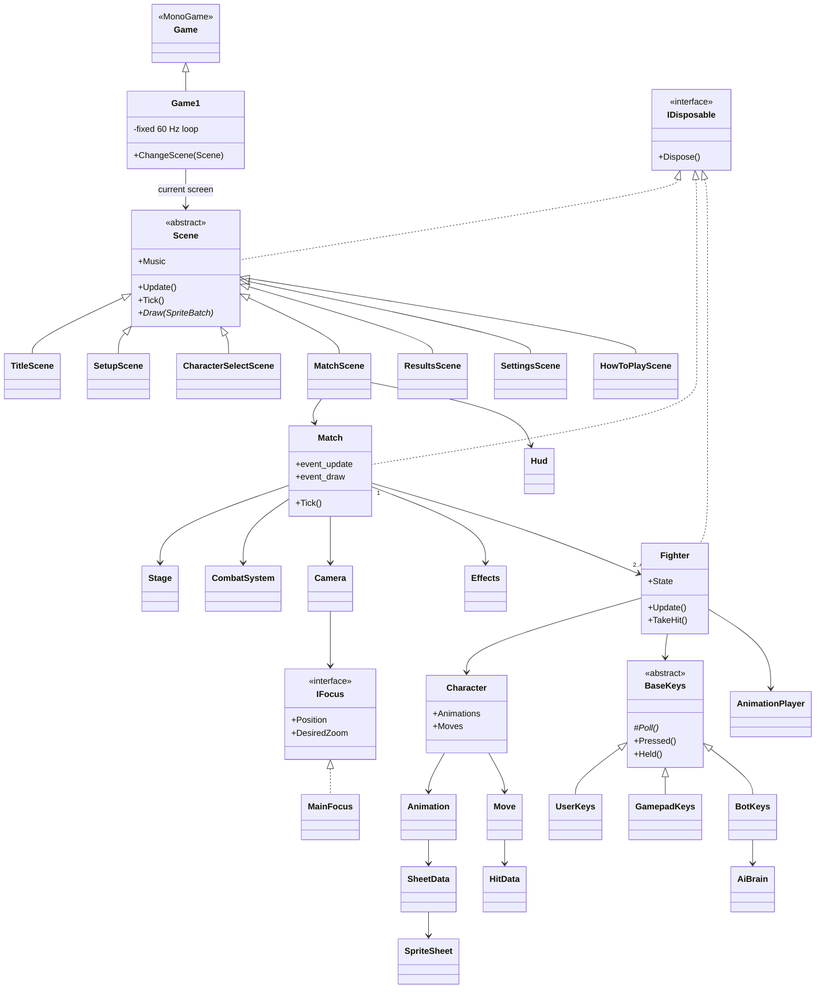

### Structs (value types)

Small, short-lived values are structs, so creating thousands of them every frame produces no garbage.

| Struct | File | What it holds |
| --- | --- | --- |
| `Circle` | Graphics/Circle.cs | Center + radius. `Intersects()` (distance between centers ≤ sum of radii) and `ToWorld()` (frame space → world space, mirrored when facing left). Used for every hitbox and hurtbox. |
| `Box` | Gameplay/Stage.cs | An axis-aligned rectangle with float edges: the stage deck, the blast zone, a fighter's body. `Overlaps()` and `Contains()`. |
| `CombatSystem.PendingHit` | Gameplay/CombatSystem.cs | One hit found this tick (attacker, defender, hit, contact point). Hits are collected first and applied afterwards, so two fighters can trade hits on the same tick. |

### Enums

| Enum | Values |
| --- | --- |
| `InputButtons` | `[Flags]` Left, Right, Up, Down, Attack, Shield. Several buttons fit in one value. |
| `FighterState` | Idle, Run, Turn, JumpSquat, Airborne, Landing, Attack, Shield, Roll, SpotDodge, AirDodge, Hitstun, ShieldBreak, Dead, Respawn, LedgeHang |
| `AnimationId` | Stand, Run, Turn, JumpSquat, Jump, Fall, Landing, Jab, MultiJab, UpTilt, UpSmash, DownSmash, NeutralAir, UpAir, Hang, Shield |
| `MoveId` | Jab, MultiJab, UpTilt, UpSmash, DownSmash, NeutralAir, UpAir |
| `HitboxDirection` | Forward, Back, Up, UpForward, Down, Sides, Around: where a hitbox is placed on the sprite |
| `SlotType`, `Sfx`, `MusicTrack` | Off/Human/Cpu, every sound effect, battle or select music |

### OOP concepts and where they are used

| Concept | Where |
| --- | --- |
| **Inheritance** | Every screen inherits from `Scene`. `UserKeys`, `GamepadKeys` and `BotKeys` inherit from `BaseKeys`. `Game1` inherits from MonoGame's `Game`. |
| **Abstract classes** | `BaseKeys` has an abstract `Poll()` and an abstract `Name`; its shared logic (pressed this tick, held for N ticks) lives in the base class. `Scene` has an abstract `Draw()`. |
| **Interfaces** | `IFocus` lets the `Camera` follow anything that has a position and a desired zoom (`MainFocus` follows all fighters). `IDisposable` on `Scene`, `Match` and `Fighter` guarantees event handlers are removed. |
| **Polymorphism** | `Fighter` calls `Keys.Update()` without knowing if a keyboard, a gamepad or the AI answers. `Game1` calls `scene.Update() / Tick() / Draw()` on whichever screen is active, and `Scene.Music` is overridden by the select screen to switch tracks. |
| **Encapsulation** | State is exposed read-only (`public FighterState State { get; private set; }`, `readonly` fields, `private` helpers), so only the fighter changes its own state. Internal types stay `internal`, and tests reach them through `InternalsVisibleTo`. |
| **Composition** | A `Fighter` is built from a `Character` (data), a `BaseKeys` (input) and an `AnimationPlayer`, replacing the deep inheritance chain of the first prototype (`Player : Collisions : Mario : Animations : Drawable`). A `Match` is built from a `Stage`, a `CombatSystem`, a `Camera` and `Effects`. |
| **Delegates and events** | `DLG_update` and `DLG_draw` (in `Core/G.cs`) are the types of the match's `event_update` / `event_draw` events. The stage, every fighter, the focus and the camera subscribe themselves; `Dispose()` unsubscribes them. |
| **Static classes** | Stateless helpers: `Knockback` (formula), `AutoHitboxes`, `SheetBuilder`, `StageSurface`, `Palette`, `DataLoader`, `G` (constants). |
| **Data-driven design** | Plain data classes (`CharacterDefinition`, `MoveDefinition`, `HitDefinition`, `FramesDefinition`, `StageDefinition`) are filled from JSON with `System.Text.Json`, so balancing a move or adding a character needs no code. |
| **State machine** | `Fighter.Update()` switches on `FighterState`; each state has its own `UpdateX()` method, and `SetState()` picks the matching animation. |

### Every class at a glance

| Area | Classes |
| --- | --- |
| Game and screens | `Program`, `Game1`, `Scene`, `TitleScene`, `HowToPlayScene`, `SettingsScene`, `SetupScene`, `CharacterSelectScene`, `MatchScene`, `ResultsScene`, `MenuList`, `Hud`, `ScreenshotTour` |
| Input | `BaseKeys`, `UserKeys`, `GamepadKeys`, `BotKeys`, `AiBrain`, `MenuInput` |
| Gameplay | `Match`, `MatchSettings`, `SlotSettings`, `Fighter`, `FighterStats`, `CombatSystem`, `Knockback`, `Stage`, `StageSurface`, `Camera`, `MainFocus`, `Effects` |
| Characters and animation | `Character`, `Animation`, `AnimationPlayer`, `SheetData`, `Move`, `HitData` |
| Graphics | `ImageData`, `SpriteSheet`, `SheetBuilder`, `AutoHitboxes`, `Palette`, `PixelFont`, `Primitives` |
| Data (JSON) | `CharacterDefinition`, `FramesDefinition`, `AnimationDefinition`, `MoveDefinition`, `HitDefinition`, `HitboxDefinition`, `StageDefinition`, `DataLoader` |
| Audio and settings | `SoundBank`, `UserSettings` |

## Key parts of the code

**Game loop (`Game1.Update`)**
Real time is added to an accumulator, and `scene.Tick()` runs once for every 1/60 s. Gameplay speed therefore never depends on the frame rate.

**Fighter state machine (`Fighter.cs`)**
Each tick the fighter:
1. reads its input
2. counts down hitlag and invincibility
3. runs the current state (`UpdateIdle`, `UpdateAirborne`, `UpdateLedgeHang`, ...)
4. applies gravity and the decaying knockback velocity
5. moves and resolves collisions with the stage, which is solid from every side
6. checks for a ledge to grab

**Combat (`CombatSystem.cs`)**
- **Clashes:** two ground attacks whose hitboxes touch make both fighters rebound.
- **Hits:** every active hitbox is tested against the other fighters' hurtboxes. A shield absorbs the damage instead.
- **Remembering hits:** each attack gets an instance number, so it hits a target only once.
- **Pushing apart:** grounded fighters standing inside each other are gently pushed apart.

**Knockback (`Knockback.cs`)**, the Smash formula:

```
raw       = ((p/10 + p·d/20) · 1.4 + 18) · growth/100 + base
knockback = raw · percent multiplier · weight multiplier
percent multiplier = 1 + p / 200        (0% → ×1, 100% → ×1.5, 200% → ×2)
weight multiplier  = 100 / weight       (Bowser 140 → ×0.71, Mario 90 → ×1.11)
```

Here `p` is the target's percent after the hit and `d` is the move's damage. Weights are set in each `character.json` according to the fighter's size. Knockback sets the launch speed (which decays every tick), the hitstun and the freeze frames.

**Sprite pipeline (`SheetBuilder.cs`, `AutoHitboxes.cs`)**
1. At load time every frame listed in `frames.json` is cut out of the full sprite sheet.
2. The background is removed by a flood fill from the frame's border, so background-like colors inside the character survive. The JPEG halo is removed too.
3. The frame is mirrored if the character faces left on the sheet.
4. Hurtboxes are generated from the silhouette (three circles along the body).
5. Each attack's hitbox is placed on the silhouette's extreme point in the direction given in `character.json` (`Forward`, `Up`, `Sides`, ...).

**Stage collision (`StageSurface`)**
Scans the stage image for the flat walkable deck and its thickness, then follows the real top edge of the platform out to its sloped tips, so fighters walk on what they see. The two tips are the ledges, and a fighter only grabs one when its body is within a few pixels of the tip and its hands are near the tip's height.

**AI (`AiBrain.cs`)**
Plans a few ticks of button presses at a time (a script queue), with a reaction delay and a chance of mistakes that depend on the level. It attacks when close, uses up smash and up air on targets above, shields incoming attacks, doesn't follow opponents off the stage, recovers with double jump and air dodge, and climbs from the ledge.

**Audio (`SoundBank.cs`)**
Every sound is generated from waveforms (sine, square, triangle, saw, noise) into PCM buffers:
- **Opening theme** (title and menus): inspirational, 96 BPM in C major. It starts with soft pads and a heartbeat bass, the melody enters in bar 5, and drums and crash cymbals lift it into a hero's theme.
- **Battle theme** (matches and results): hype 8-bit fighting music, 160 BPM in A minor. It has NES-style pulse leads with vibrato, an octave-jumping bass, 16th-note arpeggios, and a verse that climbs into a big chorus.
- **Select theme:** 146 BPM with kick, snare, hi-hats, a distorted bass riff, chord stabs and a lead, inspired by arcade fighters like Tekken.

**Resolution independence (`Scene.UiScale`, `Match.ScreenScale`)**
Everything is laid out for a 1200 × 700 screen and scaled by `G.UiScale`: the smaller of height/700 and width/1200. Menus, the HUD, the damage numbers and the camera therefore look the same in a window and in full screen at any size or aspect ratio. The camera frames the same part of the world at every resolution.

## Tools

| Tool | What it does |
| --- | --- |
| `tools/SpriteCutter` | `detect <sheet> <out>` finds and numbers every sprite on a full sprite sheet (touching frames are split at the emptiest columns) and writes annotated images. `build <cut file> <sheets> <character folder> <preview>` turns the chosen sprite numbers (`tools/SpriteCutter/cuts/<name>.json`) into `frames.json`, lining every frame up with the standing pose so the fighter doesn't jitter. |
| `tools/GifMaker` | Joins the full-screen frames recorded by `Smash --screenshots` into the looping gameplay GIF. |

**Adding a new fighter:**
1. Put the sheet in `Content/Spritesheets`.
2. Run `SpriteCutter detect` on it.
3. Write a cut file with the sprite numbers of each animation and run `SpriteCutter build`.
4. Add a `character.json`.

The fighter then appears on the select screen automatically.

## Tests

`tests/Smash.Tests` runs the game logic **without a window**, using the real sprite sheets and data:
- **Sprite and data loading:** frame cutting, background removal, mirroring and palettes, plus a check that all four fighters load with hurtboxes on every frame and hitboxes on every active frame.
- **Mechanics:** knockback, a jab adding exactly its damage, shields blocking damage, a down smash from the center of the stage killing at a sensible percent, and ledge grab then fall or climb.
- **Reach:** every ground attack of every fighter reaching an adjacent opponent.
- **Engine safety:** fighters can't clip into the stage, knockouts don't leak event handlers, and full CPU vs CPU matches finish.
- **Ledge and knockback:** the ledge is only grabbed right next to the tips, and the percent and weight multipliers behave as described.
- **Audio:** all three music tracks render without clipping or silence.

GitHub Actions builds and runs the tests on Windows and Linux on every push.

## Credits

- **Code, synthesized music and sound effects, pixel font:** Liav Samiya
- **Mario sprite sheet** (SSBB style): made by **GregarLink10**
- **Bowser sprite sheet:** **Ragey, CheDDar-X, NF and [NU]**, made for *Super Smash Flash 2*
- **Kratos sprite sheet:** edits by **sneckker**; *God of War: Betrayal* sprites ripped by **Grim**; head sprite by **TheJunior142**
- **Sasuke sprite sheet:** ripped from *Naruto: Saikyou Ninja Daikesshu 4* by **NEIMAD**
- **Stage and background:** from the project's first version
- Built with [MonoGame](https://www.monogame.net/), [StbImageSharp](https://github.com/StbSharp/StbImageSharp) and [ImageSharp](https://github.com/SixLabors/ImageSharp) (the GIF tool only)

## Legal notice

This is a **fan-made, non-commercial, educational project**. It is not sold or monetized, and it is **not affiliated with or endorsed by Nintendo, Sony Interactive Entertainment, Shueisha or any other rights holder**.

- **Characters:**
  - *Mario*, *Bowser* and *Super Smash Bros.* are © and ™ **Nintendo**.
  - *Kratos* and *God of War* are © **Sony Interactive Entertainment**.
  - *Sasuke Uchiha* and *Naruto* are © **Masashi Kishimoto / Shueisha**.
- **Sprites:** the sprite sheets in `src/Smash/Content/Spritesheets/` are fan-made or ripped sprites of these characters. They remain the property of their owners and of the artists listed in [Credits](#credits).
- **Original work:** the **source code**, the synthesized audio and the pixel font are original work by Liav Samiya.
- **Takedown requests:** if you are a rights holder and want any asset removed, please [open an issue](https://github.com/LiavSamiya/mario-smash/issues) and it will be taken down promptly.

## Author

**Liav Samiya**.

## Project history

Development started in 2019 with a first prototype. The current version is a full redesign of it: a new architecture, AI opponents, tests and CI.

<details>
<summary>Sketches and diagrams from the first prototype</summary>

| Two players at the start | The camera following the players |
| :---: | :---: |
| 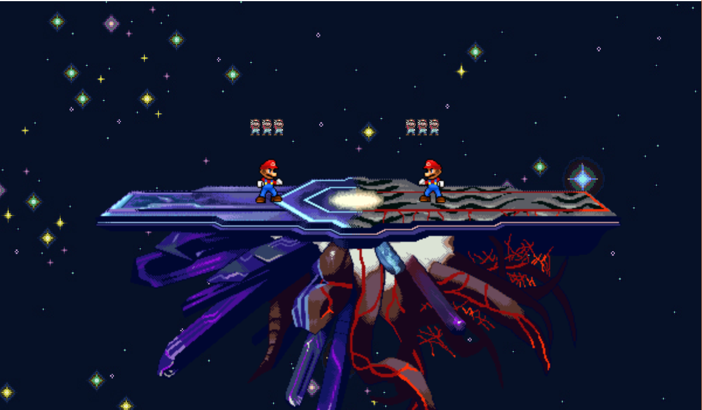 |  |

The original sprites used hand-drawn **masks**: a copy of each sprite sheet with colored point pairs marking the hitbox (red) and hurtbox (blue) circles.

| Up-air sprite (2019) | Its mask |
| :---: | :---: |
| 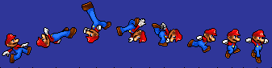 |  |

**Original UML diagrams**

**Inheritance: drawing and camera focus**

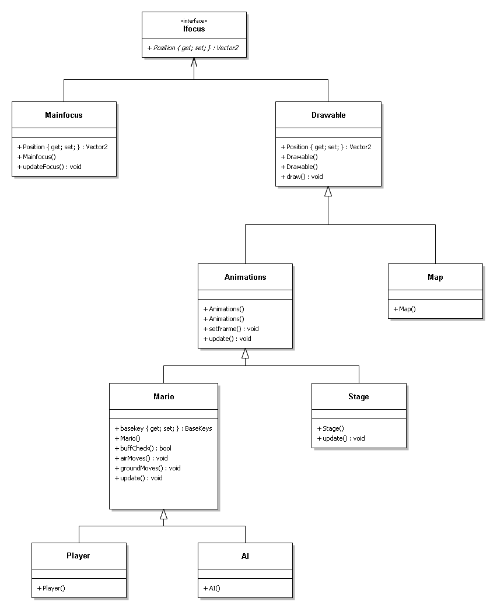

**Inheritance: input**

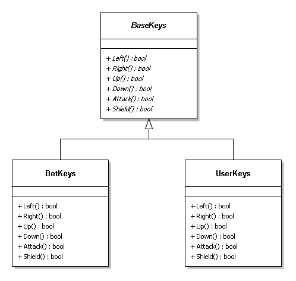

**Composition: game structure**


**Classes subscribed to the update / draw delegates**


</details>
